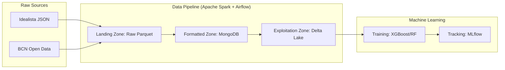

# Barcelona Housing Pipeline: End-to-End Data Engineering for Real-Estate Analytics

[](https://www.python.org/)
[](https://spark.apache.org/)
[](https://airflow.apache.org/)
[](https://delta.io/)
[](https://www.mongodb.com/)
[](https://mlflow.org/)

## Overview

This repository features a data pipeline designed to automate the ingestion, processing, and orchestration of high-volume real-estate data. By leveraging a Medallion Architecture, the pipeline transforms raw data from Idealista and Barcelona Open Data into actionable insights for predictive analytics and machine learning models.

> [!IMPORTANT]
> **Data Privacy & Storage:** The `source_datasets/` directory contains raw JSON/CSV files from **Idealista**. Due to their size and privacy constraints, these datasets are **not uploaded to this repository**. You must provide your own data sources following the schema defined in `config.yaml`.

---

## Technology Stack

Our pipeline integrates the most powerful tools in the modern data engineering ecosystem:

-   **Apache Spark (PySpark):** The core engine for distributed data processing, handling high-throughput ingestion and complex transformations with ease.
-   **Apache Airflow:** Orchestrates the entire workflow, managing complex dependencies, scheduling daily jobs, and offering a rich monitoring UI.
-   **Delta Lake:** Implemented in the "Exploitation Zone" to provide **ACID transactions**, schema enforcement, and time-travel capabilities over traditional Parquet/Avro formats.
-   **MongoDB:** Acts as our "Formatted Zone" document store, offering flexible querying over semi-structured real-estate data.
-   **MLflow:** Powers the model management lifecycle, tracking experiments, parameters, and metrics for housing price prediction.
-   **WSL & Ubuntu:** Seamless cross-platform development environment, optimizing Linux-native tools on Windows.

---

## Architecture: The Medallion Approach

The pipeline follows a structured data flow, ensuring data quality and reliability at every stage:



1.  **Landing Zone**: Ingests raw data from `source_datasets`, partitioning it by `year/month/day` for incremental processing.
2.  **Formatted Zone**: Cleanses, normalizes, and stores the data in **MongoDB**, making it ready for structured queries.
3.  **Exploitation Zone**: Consolidates multiple sources into optimized **Delta Lake** tables, designed for high-performance ML training.

---

## Setup & Installation

### Prerequisites

-   **WSL (Ubuntu):** Required for running the Spark/Hadoop ecosystem on Windows.
-   **Java 8/11:** Required for Apache Spark.
-   **Python 3.x:** With `venv` support.

### Installation

1.  **Clone the repository:**
    ```bash
    git clone https://github.com/your-username/Idealista-Data-Engineering.git
    cd Idealista-Data-Engineering
    ```

2.  **Initialize the environment:**
    ```bash
    # Create virtual environment
    python3 -m venv venv
    source venv/bin/activate

    # Install dependencies
    pip install -r requirements.txt
    ```

3.  **Activate Project Settings:**
    ```bash
    # This script configures JAVA_HOME, HADOOP_HOME, and Spark paths
    source activate_env.sh
    ```

---

## Running the Pipeline

### Via Apache Airflow (Recommended)
The pipeline is fully automated via DAGs. Start the Airflow scheduler and webserver, then trigger the `bcn_housing_pipeline` DAG.

```bash
airflow dags trigger bcn_housing_pipeline
```

### Manual Execution
You can run individual stages of the pipeline for debugging:

```bash
# Data Ingestion
python3 scripts/a3_ingestion.py

# Data Formatting (MongoDB)
python3 scripts/a4_formatting.py

# Exploitation Zone (Delta Lake)
python3 scripts/a5_explotation.py
```

---

## Configuration

All settings are centralized in `config.yaml`, allowing for easy environment customization without touching the core logic. This includes:
- MongoDB URIs and Database names.
- File system paths for all zones.
- Dataset-specific metadata (regex patterns, partitions, etc.).

---

## License
This project is for educational and research purposes. Data provided by [Idealista](https://www.idealista.com/) and [Open Data BCN](https://opendata-ajuntament.barcelona.cat/).

